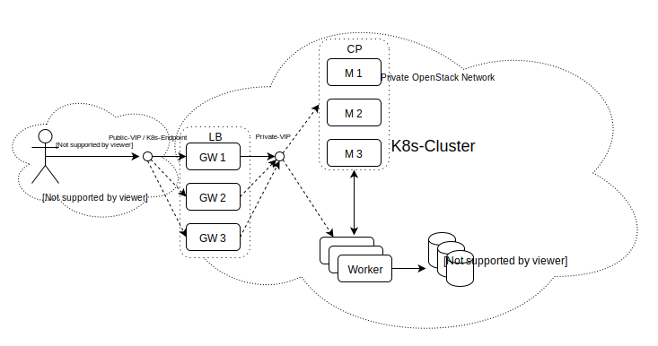
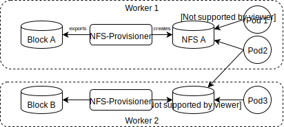

# User documentation

## Architecture



## Accessing the cluster

The K8s cluster resides in a private OpenStack network and cannot be accessed directly from the outside. Use wireguard with the attached wg0.conf file to access the control plane. Ideally the usage is as simple as `sudo wg-quick up ./wg0.conf` on the localhost. Be careful that the localhost is not already in a 192.168.0.0/24 subnet. Check the VPN connection by pinging the endpoint. On success, you can use the attached kubeconfig file to communicate with the control plane (e.g., `kubectl --kubeconfig kubeconfig get po`).

Below you can find an example how [services](#services) can be exposed to the outside.

## Block volumes

The infrastructure offers persistent block storage backed by OpenStack's Cinder service. The OpenStack Cloud Controller Manager (CCM) acts as a mediator between OpenStack and Kubernetes and runs inside the K8s cluster. If a pod requests a Persistent Volume Claim (PVC) of the storage class *csi-sc-cinderplugin*, the CCM creates a new Cinder block volume, attaches it to the worker node on which the pod runs and mounts it. Internally, the storage class resource is assigned a *provisioner* that is made avaiable by the CCM.

Such a block volume is single mount only, i.e., it can be mounted by exactly one pod at any moment in time. It depends on the policy of the PVC whether the volume is deleted or kept after the pod finishes. A complete example:

```yaml
apiVersion: storage.k8s.io/v1
kind: StorageClass
metadata:
  name: csi-sc-cinderplugin
provisioner: cinder.csi.openstack.org

---
apiVersion: v1
kind: PersistentVolumeClaim
metadata:
  name: csi-pvc-cinderplugin
spec:
  accessModes:
  - ReadWriteOnce
  resources:
    requests:
      storage: 1Gi
  storageClassName: csi-sc-cinderplugin

---
apiVersion: v1
kind: Pod
metadata:
  name: nginx 
spec:
  containers:
  - image: nginx
    imagePullPolicy: IfNotPresent
    name: nginx
    ports:
    - containerPort: 80
      protocol: TCP
    volumeMounts:
      - mountPath: /var/lib/www/html
        name: csi-data-cinderplugin 
  volumes:
  - name: csi-data-cinderplugin
    persistentVolumeClaim:
      claimName: csi-pvc-cinderplugin
      readOnly: false
```

## Shared file system (NFS)

By using an NFS exporter the single-mount restriction of block volumes can be lifted. In other words, multiple pods running on different worker nodes can access the same file system concurrently. The distributed file system can be backed by an arbitrary Persistent Volume (PV) but it makes sense to use the *csi-sc-cinderplugin* storage class introduced above. 



Note that this is still a proof of concept. The initial mounting of the volume can take up to a minute (further mounts are executed for more quickly) and naturally there is a performance overhead compared to single-mount block storage. The penality depends on the exact use case (few large files vs many small files; random vs. sequential; reading vs. writing) and needs to be evaluated on demand. The *fio* I/O benchmark tool could be used for this. A (shortened) example can be found below. The NFS provisioner needs further resources. Check the contents of `~/.managed_k8s/nfs/ext-nfs` on node **master1** for details.

Preparing the NFS volume:

```
apiVersion: storage.k8s.io/v1
kind: StorageClass
metadata:
  name: csi-sc-cinderplugin
provisioner: cinder.csi.openstack.org

---

apiVersion: v1
kind: PersistentVolumeClaim
metadata:
  name: nfs-backend
spec:
  accessModes:
    - ReadWriteOnce
  resources:
    requests:
      storage: 6Gi
  storageClassName: csi-sc-cinderplugin

---
apiVersion: v1
kind: ServiceAccount
metadata:
  name: nfs-provisioner
---
kind: Service
apiVersion: v1
metadata:
  name: nfs-provisioner
  labels:
    app: nfs-provisioner
spec:
  ports:
    - name: nfs
      port: 2049
    - name: mountd
      port: 20048
    - name: rpcbind
      port: 111
    - name: rpcbind-udp
      port: 111
      protocol: UDP
  selector:
    app: nfs-provisioner
---
kind: Deployment
apiVersion: apps/v1
metadata:
  name: nfs-provisioner
spec:
  selector:
    matchLabels:
      app: nfs-provisioner
  replicas: 1
  strategy:
    type: Recreate 
  template:
    metadata:
      labels:
        app: nfs-provisioner
    spec:
      serviceAccount: nfs-provisioner
      containers:
        - name: nfs-provisioner
          image: quay.io/kubernetes_incubator/nfs-provisioner:latest
          ports:
            - name: nfs
              containerPort: 2049
            - name: mountd
              containerPort: 20048
            - name: rpcbind
              containerPort: 111
            - name: rpcbind-udp
              containerPort: 111
              protocol: UDP
          securityContext:
            capabilities:
              add:
                - DAC_READ_SEARCH
                - SYS_RESOURCE
          args:
            - "-provisioner=example.com/nfs"
          env:
            - name: POD_IP
              valueFrom:
                fieldRef:
                  fieldPath: status.podIP
            - name: SERVICE_NAME
              value: nfs-provisioner
            - name: POD_NAMESPACE
              valueFrom:
                fieldRef:
                  fieldPath: metadata.namespace
          imagePullPolicy: "IfNotPresent"
          volumeMounts:
            - name: export-volume
              mountPath: /export
      volumes:
        - name: export-volume
          persistentVolumeClaim:
            claimName: nfs-backend
            readOnly: false
```

Creating the NFS-PVC and mount it for the pod.

```
kind: PersistentVolumeClaim
apiVersion: v1
metadata:
  name: nfs
  annotations:
    volume.beta.kubernetes.io/storage-class: "example-nfs"
spec:
  accessModes:
    - ReadWriteMany
  resources:
    requests:
      storage: 1Mi
---
apiVersion: batch/v1
kind: Job
metadata:
  name: busy-a
spec:
  template:
    spec:
      nodeSelector:
        name: worker1
      containers:
      - image: busybox
        name: busybox-a
        resources: {}
        volumeMounts:
          - mountPath: /mnt
            name: nfs
        command: ["touch", "/mnt/busybox-A"]
      restartPolicy: Never
      volumes:
        - name: nfs
          persistentVolumeClaim:
            claimName: nfs
            readOnly: false
```

## Services

The K8s cluster offers NodePort services to expose pods to the outer world. Due to the high security demands, ports must be selected from a fixed port range. Ports 30048-30060 are opened for testing purposes, i.e., the load balancing HAProxy instances are configured to forward the incoming traffic to the cluster. It is planned to offer dynamic, load balancing services, e.g., via Ingress Controllers. This would lift the need for (static) NodePorts. A complete example:

```
apiVersion: v1
kind: Service
metadata:
  name: nginx-service
spec:
  selector:
    app: nginx
  ports:
    - protocol: TCP
      nodePort: 30060
      port: 80
      targetPort: 80
  type: NodePort
---
apiVersion: v1
kind: Pod
metadata:
  creationTimestamp: null
  labels:
    app: nginx
  name: nginx
spec:
  containers:
  - image: nginx
    name: nginx
    resources: {}
  dnsPolicy: ClusterFirst
  restartPolicy: Never
status: {}
```

## Network policies

The Managed K8s cluster currently only supports the Flannel CNI plugin. Therefore [network policies](https://kubernetes.io/docs/concepts/services-networking/network-policies/) are not available yet. It is planned to either switch to a different CNI plugin or use Flannel in combination with another framework (e.g. Calico).

## Monitoring

### Grafana

Dashboards that are imported into Grafana via the web interface are lost when the service is restarted. To add dashboards in a persistent manner you can add them to the `ConfigMap` `grafana-customer-dashboards` in the namespace `monitoring`. Grafana will reload its configuration by using a simple curl command: `curl -X http://admin:<admin-password>@localhost:3000/api/admin/provisioning/dashboards/reload`, assuming that grafana's port was forwarded, e.g., via `kubectl port-forward -n monitoring svc/grafana 3000`.
