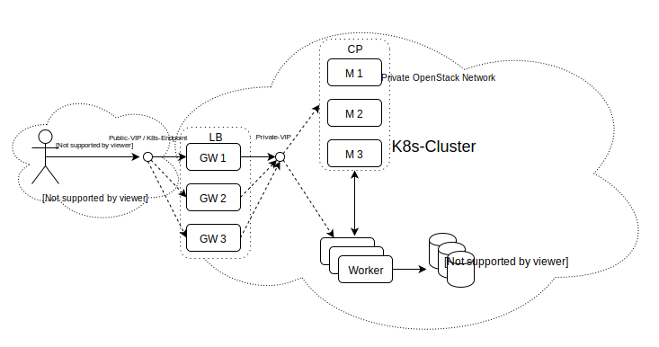

# Introduction

This project uses Ansible and OpenStack to provide a customizable, highly available and flexible managed K8s installation.

The setup routine creates the folder structure **/home/ubuntu/.managed_k8s** on the node **master1**. It contains k8s resources used to connect to the underlying OS infrastructure and to do some smoketesting.

**Note: The following text consists of rough notes on the architecture**

* three kinds of hosts: gateway nodes, k8s master nodes and k8s worker nodes
* gateway nodes are made redundant via keepalived
* the number of master nodes should be uneven (1, 3, 5, ..) because K8s uses the Raft protocol. In order to prevent the split brain problem the majority of nodes has to be up with 3 master nodes, one can fail without problem. With 2 out, the last one will stop working because it does not know if this is just a network partitioning. 5 nodes can handle 2 failed nodes

Multi-Master K8s setup with etcd database running on the same VMs.

Gateway nodes are the only entrypoints into the private network because they are the only ones holding floating IPs. They also act as SSH jumphosts. Each gateway hosts an instance of HAProxy. HAProxy acts a load-balancing endpoint for the K8s apiserver. The gateways are made redundant with keepalived. An extra network port is used to hold both the private and the public virtual IP (VIP). As a health check, a script queries the /healthz resource of HAProxy. Both services run in docker containers for isolation. They might in the future, however, be jailed by systemd instead.

On each master node, an OpenStack cloud controller manager (CCM) is running that acts as an interface between the cluster and OpenStack. Kubelet is started with --cloud-provider=external. Block storage can be dynamically provisioned by OS cinder via the Cinder Container Storage Interface (CSI) plugin.

Backups should be made of all credentials (certificates), the etcd database and, if necessary, persistent volumes. Backups are useful when, e.g., a K8s upgrade fails or the user accidently deleted an important resource. A cronjob dumps the etcd database every N minutes and ensures that the number of backup instances is contained. One candidate for managing the backups is borg. To restore the cluster re-run kubeadm with an existing etcd database.
