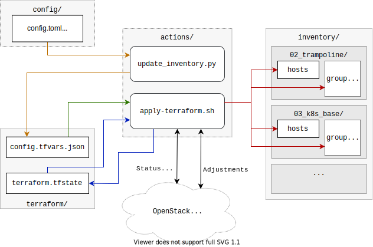
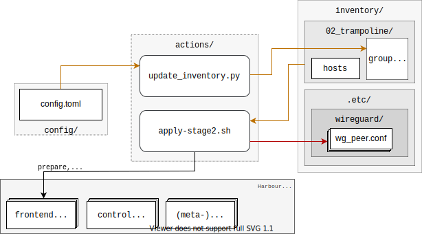
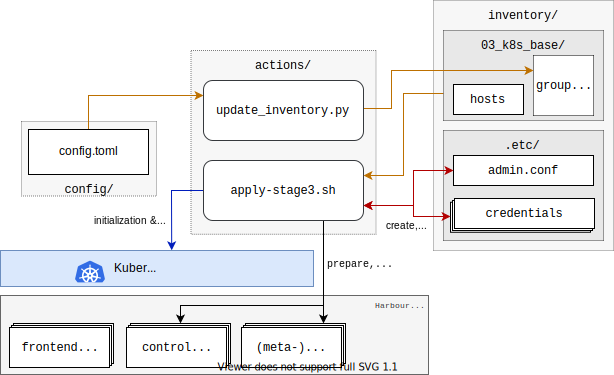
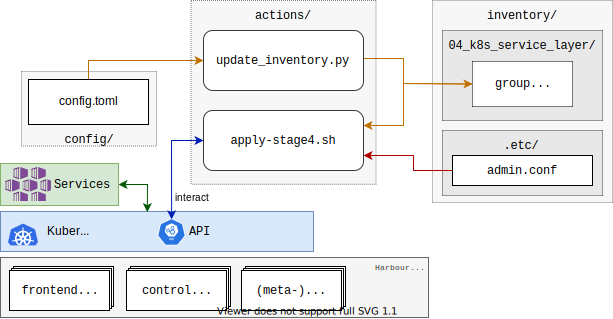

# Actions Reference

The `managed-k8s` submodule provides the following ready-to-use action scripts to work with the
cluster repository.
The scripts extensively rely on environment variables.
See the [Environment Variables Reference](./../usage/environmental-variables.md) for details.

  - [`init.sh`](#initsh)
  - [`apply.sh`](#applysh)
  - [`apply-terraform.sh`](#apply-terraformsh)
  - [`apply-stage2.sh`](#apply-stage2sh)
  - [`apply-stage3.sh`](#apply-stage3sh)
  - [`apply-stage4.sh`](#apply-stage4sh)
  - [`apply-stage5.sh`](#apply-stage5sh)
  - [`apply-custom.sh`](#apply-customsh)
  - [`test.sh`](#testsh)

Additional operating scripts:
  - [`system_update_nodes.sh`](#system_update_nodessh)
  - [`destroy.sh`](#destroysh)
  - [`wg-up.sh`](#wg-upsh)
  - [`manage_roles.py`](#manage_rolespy)
  - [`manual-terraform.sh`](#manual-terraformsh)
    - [Examples](#examples)
  - [`update_inventory.py`](#update_inventorypy)
  - [`upgrade.sh`](#upgradesh)
  - [`migrate-docker-containerd.sh`](#migrate-docker-containerdsh)
  - [`lib.sh`](#libsh)

## `init.sh`

The `init.sh`-script is used for the [Cluster Repository Initialization](./../usage/initialization.md).
Before executing this script you **must** have configured your [environment variables](./../usage/environmental-variables.md).
The script will create the basic cluster repository structure as described [here](./../design/cluster-repository.md).
Except in very rare cases where a new feature requires it, you'll need and should execute this script only once.

## `apply.sh`

`managed-k8s/actions/apply.sh` is a wrapper script which can be used to create a yk8s on top of OpenStack.

The script triggers the execution of the following scripts:

  - [`apply-terraform.sh`](#apply-terraformsh)
  - [`apply-stage2.sh`](#apply-stage2sh)
  - [`apply-stage3.sh`](#apply-stage3sh)
  - [`apply-stage4.sh`](#apply-stage4sh)
  - [`apply-stage5.sh`](#apply-stage5sh)
  - [`apply-custom.sh`](#apply-customsh)
  - [`test.sh`](#testsh)

## `apply-terraform.sh`

<center>
  
</center>

The `apply-terraform.sh`-script creates and updates the underlying cluster platform infrastructure
(sometimes also called harbour infrastructure layer) as defined by the [configuration](./../usage/cluster-configuration.md).
It also creates and updates the inventory files for ansible (`inventory/*/hosts`) and creates some variables in
the inventory (all created files have the `terraform_` prefix).

## `apply-stage2.sh`

<center>
  
</center>

The `apply-stage2.sh`-script can be used to trigger the frontend preparation.
This script triggers an Ansible playbook which installs and prepares the frontend nodes,
including rolling out all users, setting up the basic infrastructure for C&H LBaaS and configuring wireguard.

## `apply-stage3.sh`

<center>
  
</center>

This installs the Kubernetes worker and master nodes, including rolling out
all users, installing Kubernetes itself, deploying Rook, Prometheus etc.,
and configuring C&H LBaaS (also on the frontend nodes) if it is enabled.

## `apply-stage4.sh`

<center>
  
</center>

> TODO: add details


## `apply-stage5.sh`

<center>
  
</center>

> TODO: add details


## `apply-custom.sh`

<center>
  
</center>

> TODO: add details


## `test.sh`

This runs the cluster test suite. It ensures basic functionality:

- Starting a pod & service
- Cinder volume block storage
- Rook ceph block storage (if enabled)
- Rook ceph shared filesystem storage (if enabled)
- C&H LBaaS (if enabled)
- Pod security policies (if enabled)
- Network policies (if enabled)
- Monitoring (if enabled)

## `system_update_nodes.sh`

This triggers system updates of the host nodes (harbour infrastructure layer).
That includes updates of the frontend nodes and as well as Kubernetes nodes.
As this may be a disruptive action, you have to explicitly allow system updates by setting [`MANAGED_K8S_RELEASE_THE_KRAKEN`](./../usage/environmental-variables.md#behavior-altering-variables).
Nodes will get updated one after another if they are already initialized.
Between the node updates, it is verified that the cluster is healthy.
These verification checks can be skipped by passing `-s`.

```console
# Trigger system updates of nodes
$ MANAGED_K8S_RELEASE_THE_KRAKEN=true bash managed-k8s/actions/system_update_nodes.sh [-s]
```

## `destroy.sh`

Destroy the entire cluster and all of its data.

This is, obviously, destructive. Don’t run light-heartedly.

## `wg-up.sh`

When the Wireguard tunnel needs to be up, it is automatically setup by all `apply-*.sh`-scripts.

Bring up the WireGuard VPN to the cluster.

It tries to be smart about not doing anything stupid and ensuring that you’re
really connected to the correct cluster.

## `manage_roles.py`

This Python script should be used to create new Ansible roles and update and extend the meta information of existing ones.
The script can create and update roles with a minimal skeleton and an extended one (`--full`).

For further information on Ansible meta information take a look [here](https://galaxy.ansible.com/docs/contributing/creating_role.html#role-metadata).

```
usage: manage_roles.py [-h] {init,update} ...

positional arguments:
  {init,update}  Desired action to perform
    init         Initialize the skeleton for a new ansible role
    update       Update the existing ansible role. This action only updates the meta/main.yaml of the existing ansible role. If you want to create missing skeleton directory structure use `--create-missing` argument.

optional arguments:
  -h, --help     show this help message and exit
```

## `manual-terraform.sh`

This is a thin wrapper around Terraform. The arguments are passed on
to Terraform, and the environment for it is set to use the same module
and state as when run from `apply-terraform.sh`.

This is useful for operational interventions, debugging and
development work (e.g. to inspect the state or to taint a resource in
order to have it rebuilt when running `apply.sh`).

Example usage:
```
$ ./managed-k8s/actions/manual-terraform.sh taint 'openstack_compute_instance_v2.master["managed-k8s-master-1"]'
```

### Examples

Creating a new role into the k8s-base directory:

```python
python3 managed-k8s/actions/manage_roles.py init "ROLE_NAME" --path managed-k8s/k8s-base/roles
```

Updating the authors for all KSL roles:

```python
python3 actions/manage_roles.py update '*' --path k8s-service-layer/roles --author "AUTHORS"
```

## `update_inventory.py`

<center>
  
</center>

The inventory updater is triggered automatically in advance of each action script.
It cleans up the inventory and ensures the latest variable/value pairs from your configuration file are used.

## `upgrade.sh`

This script can be used to trigger a Kubernetes upgrade.
More details about that can be found [here](./upgrading-kubernetes.md).

## `migrate-docker-containerd.sh`

This script can be used to migrate the CRI of all nodes of a cluster from docker to containerd.
It is a wrapper script for the `migrate-docker-to-containerd` playbook located in `k8s-base/migrate-docker-to-containerd.yaml`.
More details about this procedure can be found in this [dedicated operation document](./../operation/migrate-docker-containerd.md).

Intermediate cluster health verification tasks can be skipped via `-s`.
This is not recommended.

Disruption needs to be allowed explicitly.

```console
MANAGED_K8S_RELEASE_THE_KRAKEN=true bash managed-k8s/actions/migrate-docker-containerd.sh [-s]
```

## `lib.sh`

The `lib.sh` is included by other action scripts and defines commonly used variables and function definitions.
